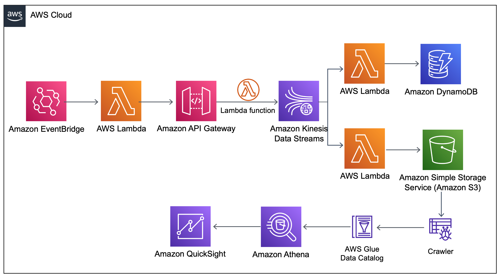

# spotify_project
Spotify data AWS pipelines project for Futurice Academy application, 2021

## Goal of the project in brief
The goal of this project is to poll Spotify data on top50 charts from 61 country (plus global chart) on a weekly basis, put it to the couple of pipelines using AWS services, and analyze charts data with dashboard. The focus and effort in this project is to use AWS services only and focus on building pipelines.

## Spotify data: what and why
Spotify provides interesting [metrics](https://developer.spotify.com/documentation/web-api/reference/#object-audiofeaturesobject) for every track, which makes it possible to analyze what kind of songs in terms of energy, danceability, tempo, mode (minor or major) etc make it to the top50, and if there any difference in music taste between various countries. 

I used python library [spotify](https://spotipy.readthedocs.io/en/2.19.0/#) to make Spotify calls. 
Two types of calls were done: 
1. Get list of tracks for every top50 chart playlist
2. Get audio features for every track in a playlist.

I selected following features for analysis:
- <b>danceability</b>: Danceability describes how suitable a track is for dancing based on a combination of musical elements including tempo, rhythm stability, beat strength, and overall regularity. A value of 0.0 is least danceable and 1.0 is most danceable.
- <b>energy</b>: Energy is a measure from 0.0 to 1.0 and represents a perceptual measure of intensity and activity.  Perceptual features contributing to this attribute include dynamic range, perceived loudness, timbre, onset rate, and general entropy.
- <b>instrumentalness</b>: Predicts whether a track contains no vocals. “Ooh” and “aah” sounds are treated as instrumental in this context. Rap or spoken word tracks are clearly “vocal”. The closer the instrumentalness value is to 1.0, the greater likelihood the track contains no vocal content. Values above 0.5 are intended to represent instrumental tracks, but confidence is higher as the value approaches 1.0.
- <b>tempo</b>: The overall estimated tempo of a track in beats per minute (BPM). In musical terminology, tempo is the speed or pace of a given piece and derives directly from the average beat duration.
- <b>valence</b>: A measure from 0.0 to 1.0 describing the musical positiveness conveyed by a track. Tracks with high valence sound more positive (e.g. happy, cheerful, euphoric), while tracks with low valence sound more negative (e.g. sad, depressed, angry).
- <b>mode</b>: Mode indicates the modality (major or minor) of a track, the type of scale from which its melodic content is derived. Major is represented by 1 and minor is 0.
Unfortunately, Spotify API doesn't provide possibility to fetch playlist IDs for top50 chart for a given country, so I found playlists' IDs online and harcoded them in.

### Hypothesis
My hypothesis is that people from different countries and cultures might prefer on average different music. For example, Latin world is known for its fantastic energetic music and dances, such as salsa. While places like Finland, Sweden or Norway have world-known heavy metal bands that easily make it to the charts. Perhaps somewhere in this world, unbeknown to me, people prefer slower tempo music. In summer time whole world might prefer vibrant high tempo "summer bangers" in major mode, and in winter (DJF in northern hemisphere and JJA in southern hemisphere) everyone is more melancholic, minor mode ballads.

## Project implementation
All work happens fully on AWS, starting from the Spotify API calls, to the data visualization. Below is brief explanation of the workflow and pipelines. 
1. To run Spotify API calls, a lambda function was created (see [code](https://github.com/ksenia-tabakova/spotify_project/blob/main/myFetchSpotifyDataSendtoAPI/lambda_function.py)). Lambda is triggered by CloudWatch event every week. At the first invocation constant json input is parsed, then lambda function invokes itself and starts making Spotify API calls for every country, one country after another, one track at a time, till all countries are exhausted. This allows Spotify API to make all calls within lambda's lifetime and in parallel. This lambda function was implemented as deployment package because it utilizes non-standard libraries: requests and spotipy.
2. Spotify data is parsed to API Gateway I created. It has single method POST with lambda integration type. The [lambda function](https://github.com/ksenia-tabakova/spotify_project/blob/main/myAPIGatewayToKinesis/lambda_function.py) pulls data from API Gateway and places it to the Kinesis datastream.
3. Lambda to read data from Kinesis and put to DynamoDB table was created (see [code](https://github.com/ksenia-tabakova/spotify_project/blob/main/myKinesisToDynamoDB/lambda_function.py)). This is the end of one of the pipelines. I didn't have more time to develop it further, but I have some ideas which I descibe briefly in the future work section.
4. Lambda to read data from Kinesis and put to S3 bucket was created (see [code](https://github.com/ksenia-tabakova/spotify_project/blob/main/myKinesisToS3Bucket/lambda_function.py))
5. I created AWS Glue database in console and made a crawler that runs over objects in S3 bucket, creating a table with Spotify data, with trackID as primary key. For the current implementation crawler is set to run on demand.
6. I created AWS Athena database from AWS Glue database in console.
7. Athena database was connected to the QuickSight in console to create data analysis.

AWS diagram:

## Data analysis in QuickSight

## Future work
There are couple of things that would be worth improving/implementing.
1. All steps in the workflow can be automated. This will simplify my job as a data engineer and will keep data analyst/scientist happy, receiving all necessary data once per week. For this Cloud Formation template can be created.
2. DynamoDB pipeline in the current state ends ubruptly. I left it in, however, to demonstrate my skills. If I had bit more time to work with it, I would do TBA
3. Present data analysis can be improved in terms of depth and interrelations between studied parameters. It wasn't a focus for me in this project, and I would definitely like to spend more type crunching this data. 
